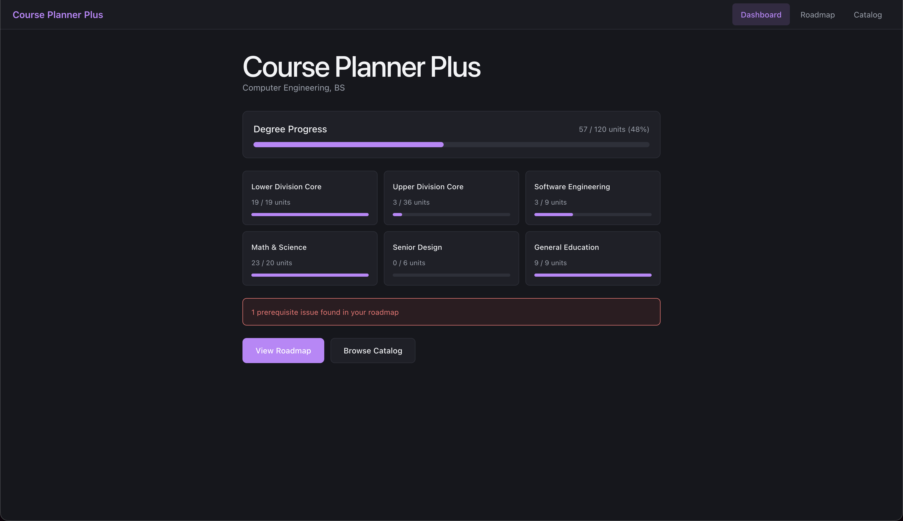
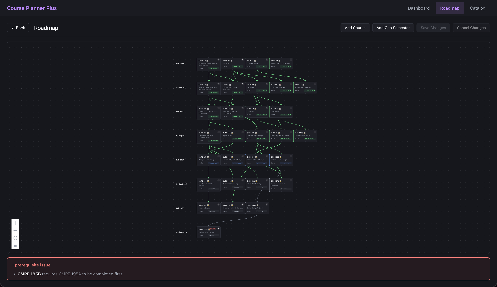
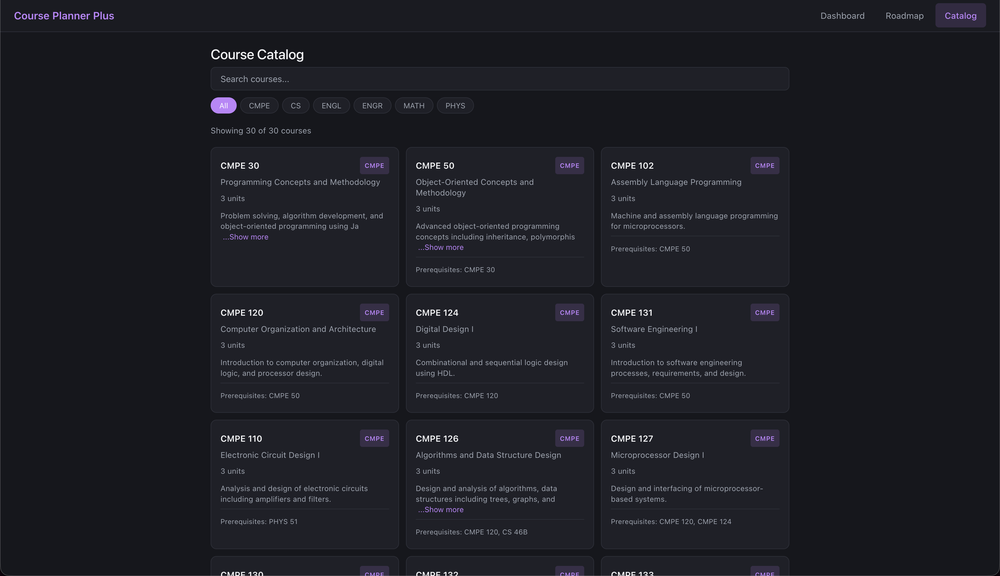
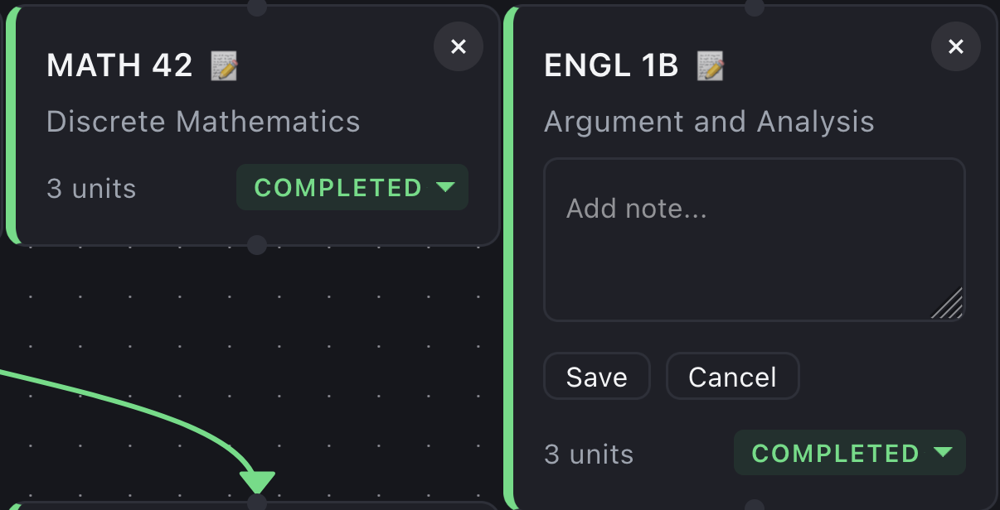

# Course Planner Plus

## Team

| Name   | GitHub                                    | Email                 |
|--------|-------------------------------------------|-----------------------|
| Dayven | [@daylenh](https://github.com/daylenh)  | dayven.lenh@sjsu.edu         |
| Mita   | [@miiiyyi](https://github.com/miiiyyi)  | mita.yang@sjsu.edu   |
| Jiajun | [@smol-derp](https://github.com/smol-derp)  | jiajun.zheng@sjsu.edu |
| Yunfei | [@ychen1026](https://github.com/ychen1026) | yunfei.chen@sjsu.edu  |

**Advisor:** Carlos Rojas

---

## Problem Statement

University students often struggle with effectively planning their academic journey due to limited guidance and disconnected tools. Existing systems at SJSU, like MyPlanner and MyScheduler, allow students to see a set of required courses and generate semester schedules, but they are lacking when it comes to prerequisite validation, providing information on major/minor requirements, real-time class availability information, and the ability to simulate problems such as gap semesters or course failures. 

## Solution

An **interactive roadmap** will be built into a single, centralized academic planning platform that allows students to map out their desired entire path to graduation in one place. This project will focus on dynamically visualizing prerequisite relationships and the critical path that will determine the time to complete a degree. This information will help students clearly see what classes are more urgent, what classes contribute to completing a minor, and how delays or changes in their schedule can impact their graduation timeline.

### Key Features

- Dynamic Prerequisite Visualization: 
    - An interactive graph that displays course dependencies and highlights the critical path required for graduation.
- Real-Time Plan Adjustment:
    - Automatically update the interactive roadmap information based on user preferences.
- Critical Path Demonstration:
    - Visually marks the sequence of courses that directly determine degree completion rate.

---

## Demo (will update when more complete)

[Link to demo video or GIF]

**Live Demo:** [URL if deployed]

---

## Screenshots

| Feature      | Screenshot                                    |
|--------------|-----------------------------------------------|
| Dashboard    |  |
| Roadmap      |    |
| Catalog      |    |
| Course Notes |      |

---

## Tech Stack

| Category | Technology                           |
|----------|--------------------------------------|
| Frontend | React, Vite, React Router, ReactFlow |
| Backend | Kotlin, Spring Boot, Gradle, JSoup   |
| Database | MySQL                                |
| Deployment | TDB                                  |

---

## Getting Started

### Prerequisites

Make sure you have the following installed:
- Git
- JDK 21
- Node.js 20+ and npm
- IntelliJ IDEA recommended

> Gradle does not need to be installed separately because this project uses the Gradle wrapper.
> MySQL is not required yet. Tests use H2 in memory and the runs without a database attached.


### Installation

```bash
# Clone the repository
git clone https://github.com/SJSU-CMPE-195/group-project-team-10.git
cd group-project-team-10

# Install frontend dependencies
cd frontend
npm install
cd ..
```

Backend dependencies are resolved automatically by Gradle the first time you run `./gradlew bootRun` or `./gradlew build`.

### Running Locally

Run the backend and frontend in separate terminals.

#### Backend
```bash
cd backend
./gradlew bootRun
# Available at http://localhost:8080
# Health check: http://localhost:8080/api/health
```

#### Frontend
```bash
cd frontend
npm run dev
# Available at http://localhost:5173
```

### Running Tests

```bash
# Backend (JUnit 5, H2 in memory)
cd backend
./gradlew test

# Frontend (Vitest + React Testing Library)
cd frontend
npm run test          # single run
npm run test:watch    # watch mode
```

---

## API Reference

<details>
<summary>Click to expand API endpoints</summary>

| Method | Endpoint | Description |
|--------|----------|-------------|
| GET  | `/api/health` | Health check — returns `{"status":"ok"}` |
| GET  | `/api/scrape/test` | Preview parsed SJSU Fall 2026 schedule rows (optional `?limit=N`) |
| GET  | `/api/scrape/debug` | Scrape stats + sample rows for debugging |
| POST | `/api/scrape/import` | Scrape SJSU Fall 2026 schedule page and persist sections to the DB |
| GET  | `/api/sections` | List all persisted sections (optional `?term=`) |
| GET  | `/api/schedule-data/full-schedule` | All course offerings (optional `?term=`) |
| GET  | `/api/schedule-data/departments/{dept}/courses` | Courses for a given department |

</details>

---

## Project Structure

```
group-project-team-10/
├── backend/                          # Kotlin + Spring Boot backend (Gradle)
│   └── src/main/kotlin/edu/sjsu/courseplanner/backend/
│       ├── controller/               # REST controllers (health, scrape, sections)
│       ├── service/                  # JSoup schedule scraper + data services
│       ├── repository/               # Spring Data JPA repositories
│       ├── model/                    # JPA entities (SectionEntity active; others placeholder)
│       ├── dto/                      # Request/response DTOs
│       └── config/                   # CORS config
├── frontend/                         # React + Vite frontend
│   └── src/
│       ├── pages/                    # Dashboard, Roadmap, Catalog
│       ├── components/               # CourseNode, CourseCard, ValidationAlert, Layout
│       ├── context/                  # RoadmapContext (reducer-based state)
│       ├── data/                     # Static courses, prerequisites, degree requirements
│       └── utils/                    # prerequisiteValidator
├── docs/                             # diagrams, screenshots
├── .github/workflows/                # CI pipeline
└── README.md
```

---

*CMPE 195A/B - Senior Design Project | San Jose State University | Spring 2026*
